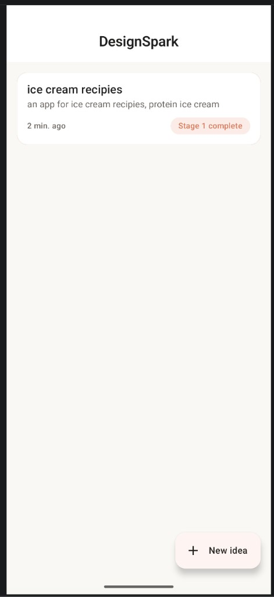
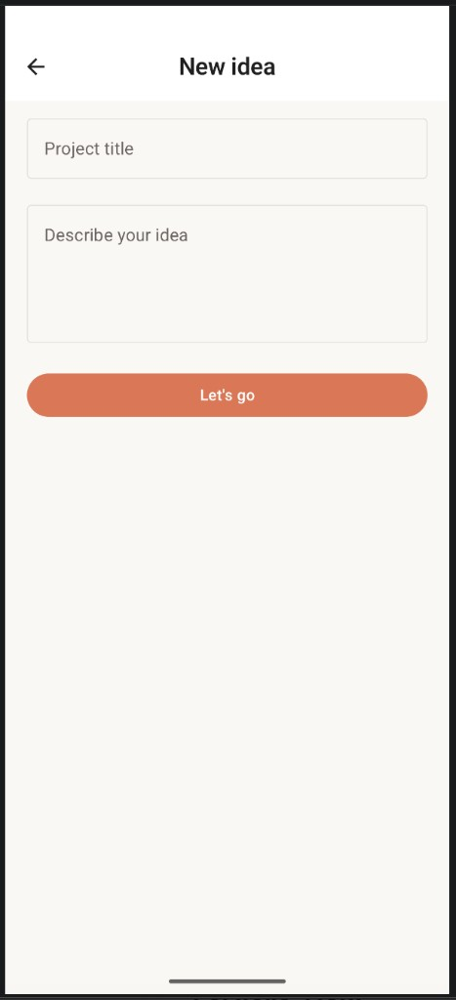
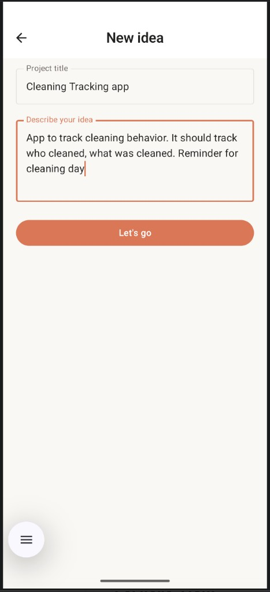
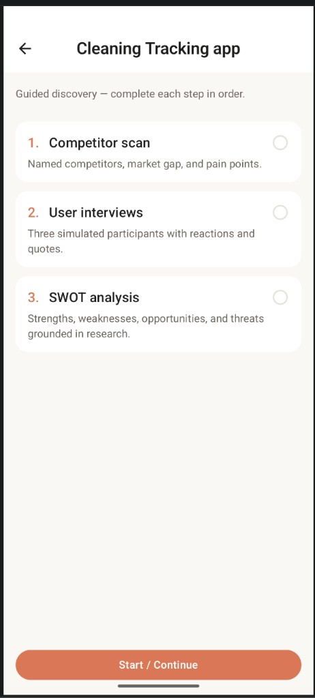
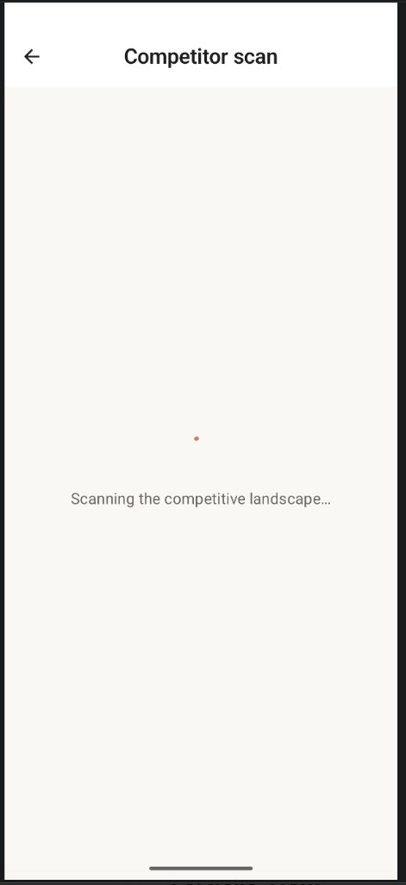
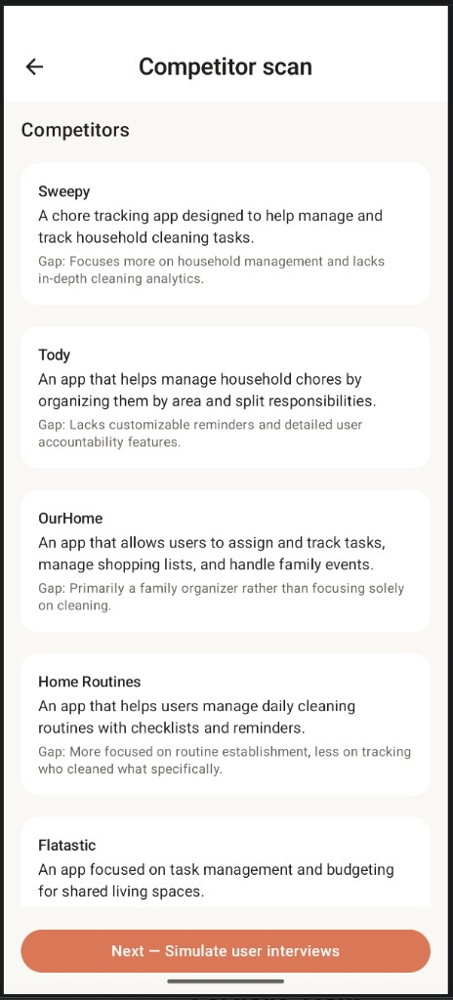
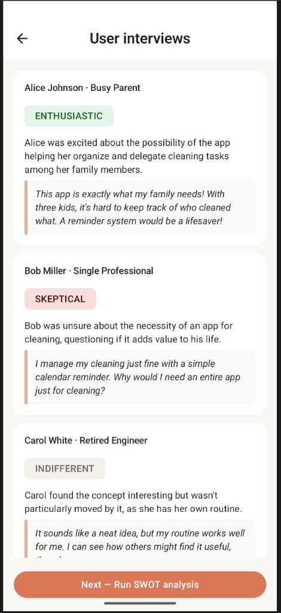
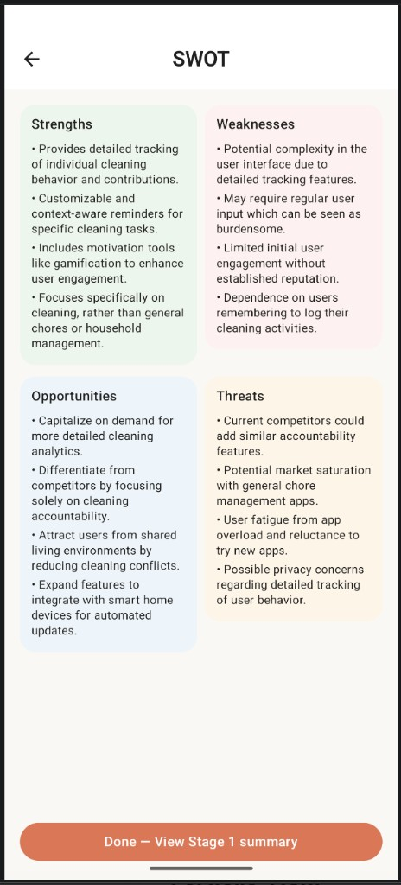
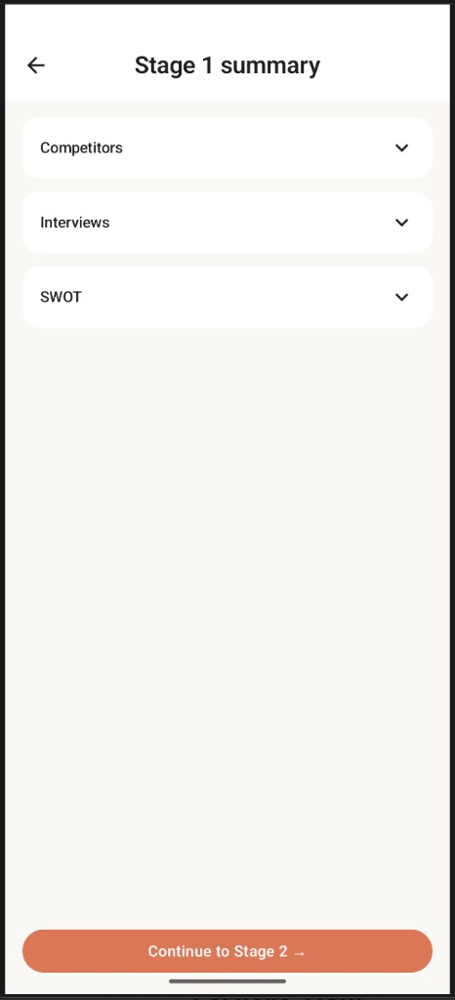
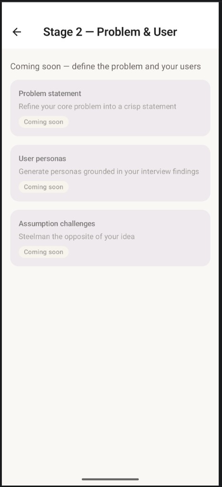

# DesignSpark

DesignSpark is an Android companion for **early product discovery**. You capture a short **project title and idea**, then work through **Stage 1 — guided discovery**: a **competitor scan** (named apps, gaps, pain points), **simulated user interviews** (personas with sentiment, summaries, and quotes), and a **SWOT** grounded in that research. When Stage 1 is complete, a **summary** screen lets you review everything before moving on. The flow suits HCI and UX coursework or solo ideation when you want structured, AI-assisted research artifacts you can iterate on.

---

## App idea

- **Problem:** Turning a vague app idea into defensible research notes (competition, users, strategy) is slow and easy to skip.
- **Approach:** One idea = one **project**. Stage 1 is a **fixed sequence** (competitor scan → interviews → SWOT) with clear “next step” actions and progress stored on device.
- **AI role:** The app calls the **OpenAI API** to produce structured outputs; results are **saved in Room** so you can reopen a project without repeating network calls.

---

## Tech stack

| Area | Choice |
|------|--------|
| Language | Kotlin (JVM 11) |
| UI | Jetpack Compose, Material 3 |
| Navigation | Navigation Compose |
| DI | Hilt (KSP) |
| Local data | Room (KSP) |
| Networking | Retrofit, OkHttp (logging), Gson |
| Async | Kotlin coroutines (`Dispatchers.IO` for I/O) |
| Images | Coil (Compose) |
| Testing | JUnit, MockK, Turbine, Compose UI tests, Room in-memory for Android tests |

**Build:** Android Gradle Plugin with `compileSdk` 36, `minSdk` 26, `targetSdk` 35. OpenAI key is supplied via `local.properties` and exposed as `BuildConfig.OPENAI_API_KEY` (not committed).

---

## Architecture

**MVVM + Clean Architecture** in three layers:

```
UI (Jetpack Compose)
  ↓ events / state
ViewModels (Hilt, StateFlow)
  ↓ use cases
Domain (pure Kotlin — no Android deps)
  ↓ repository interface
Data (Room + Retrofit)
```

- **UI** — Screens observe a single `UiState` (or equivalent) with `collectAsStateWithLifecycle()`. Composables stay thin; navigation callbacks are injected.
- **Domain** — One use case per meaningful action (e.g. create project, generate competitors / interviews / SWOT, mark Stage 1 complete). The repository is defined here; Room entities and DTOs do not leak upward.
- **Data** — `ProjectRepositoryImpl` coordinates DAOs and the OpenAI Retrofit service. **Room is the source of truth**: generated artifacts are written after successful API responses and exposed as `Flow`s for the UI.
- **DI** — Hilt modules provide the database, API, and repository bindings (`@HiltViewModel` in the UI layer).

This keeps **offline-first** behaviour: once Stage 1 outputs exist, lists and detail screens can render from local data; **new generation** still requires network and shows errors / retry when unavailable.

---

## Coming soon

These stages and features are **in the product direction** but **not fully implemented** yet (placeholders exist in the app where noted).

**Stage 2 — Problem & user**

- **Problem statement** — Refine the core problem into a crisp statement.
- **User personas** — Generate personas grounded in interview findings.
- **Assumption challenges** — Steelman the opposite of your idea.

**Stage 3 — MVP scope**

- **Feature prioritisation** — Impact vs effort for a feature list.
- **Must-have vs nice-to-have** — Ruthless scope cutting before build.
- **PRD draft** — A simple product requirements outline to share.

Later roadmap items may include deeper **Stage 1 editing** (manual tweaks to generated cards), **export/share**, and **real tracking/product** features beyond discovery (the sample “cleaning tracking” idea in the screenshots is one use case the AI can reason about—not yet a built-in task tracker).

---

## Setup

### API key

1. Create `local.properties` in the project root (it is gitignored) if you do not already have one from Android Studio.
2. Add your OpenAI API key:

   ```
   OPENAI_API_KEY=sk-...
   ```

3. The key is injected at build time via `BuildConfig.OPENAI_API_KEY` and sent in the `Authorization: Bearer` header. It is never committed (`.gitignore` excludes `local.properties`).

### Build

Open the project in Android Studio Meerkat (or newer) and sync Gradle.

```bash
# From the project root:
./gradlew assembleDebug
./gradlew test                  # unit tests
./gradlew connectedAndroidTest  # instrumented tests (device/emulator)
```

---

## Screenshots

Home — idea list with stage status.



New idea — title and description.



Example idea captured (cleaning / accountability use case).



Stage 1 — guided discovery checklist for a project.



Competitor scan — loading.



Competitor scan — results.



Simulated user interviews.



SWOT analysis.



Stage 1 summary (accordion sections).



Stage 2 — coming soon placeholder.


